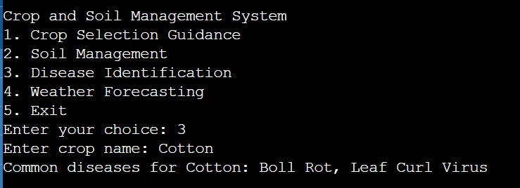

# hackthon-2
# Crop and Soil Management System

## Overview
The Crop and Soil Management System helps farmers with:
- **Crop Selection:** Guidance based on soil type and season.
- **Soil Management:** Provides information on soil properties and recommended fertilizers.
- **Disease Identification:** Identifies common diseases affecting specific crops.
- **Weather Forecasting:** Offers weather predictions and farming recommendations.

## Features
- **Crop Selection:**
  - Suitable crops based on soil type (Loamy, Clay, Sandy) and season (Winter, Monsoon, Summer, Spring).
  - Supports 10 crops including Wheat, Rice, Maize, Barley, Soybean, Potato, Tomato, Cotton, Sugarcane, and Peanut.

- **Soil Management:**
  - Provides pH level, nutrients, and recommended fertilizers for each soil type.

- **Disease Identification:**
  - Lists common diseases for each crop.

- **Weather Forecasting:**
  - Offers daily weather predictions and farming advice based on conditions.

## Technologies Used
- **Language:** Python
- **Output:** Console-based interaction

## Screenshots
(Screenshots would be inserted here showing the menu and sample outputs.)

### 1. Crop Selection

### 2. Soil Management

### 3. Disease Identification

### 4. Weather Forecasting

### 5. Exit from the Data

